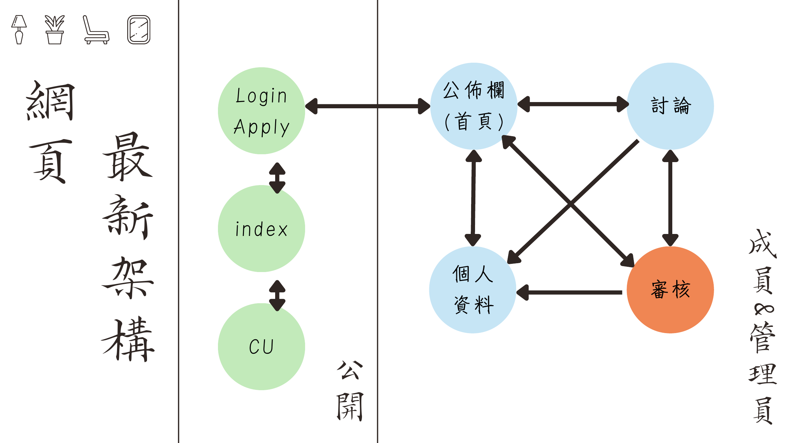
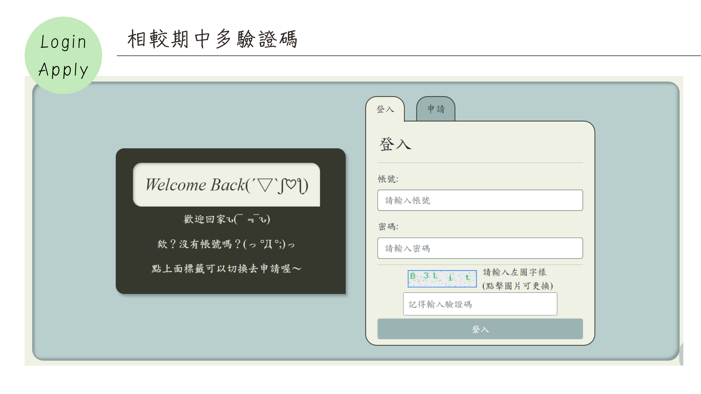
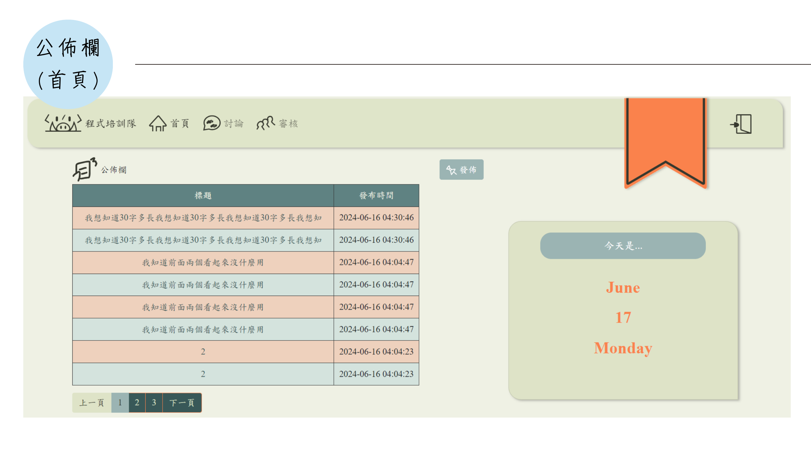
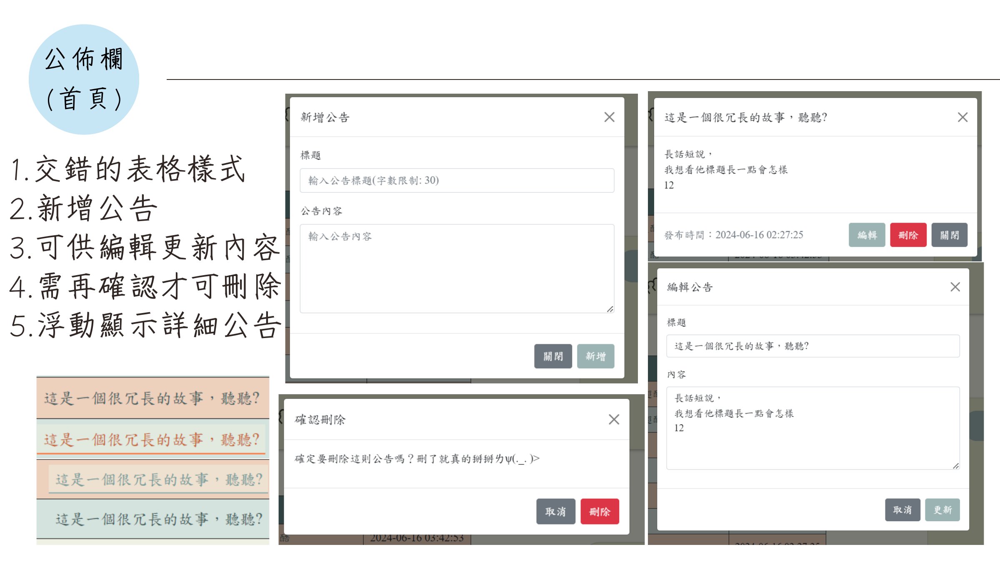
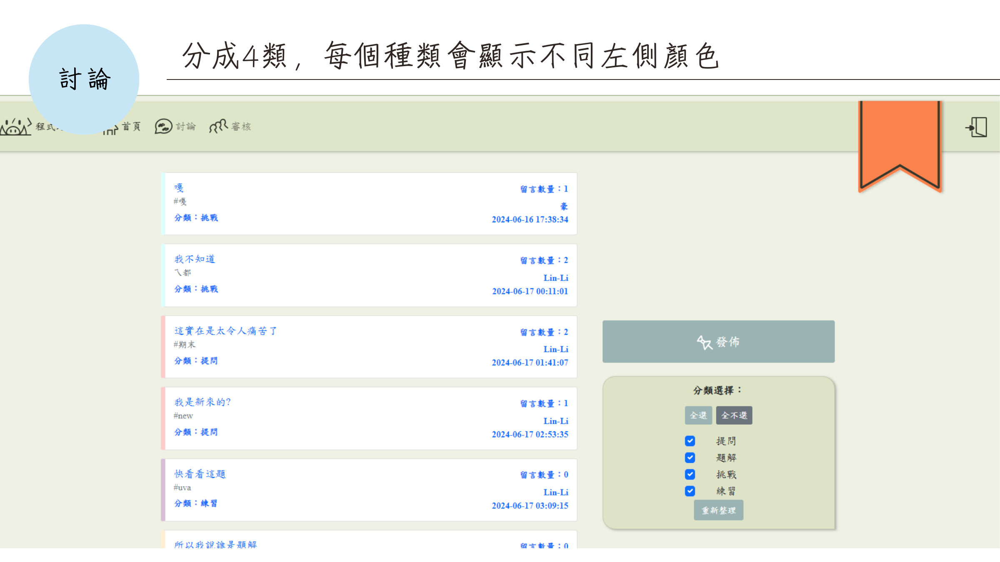
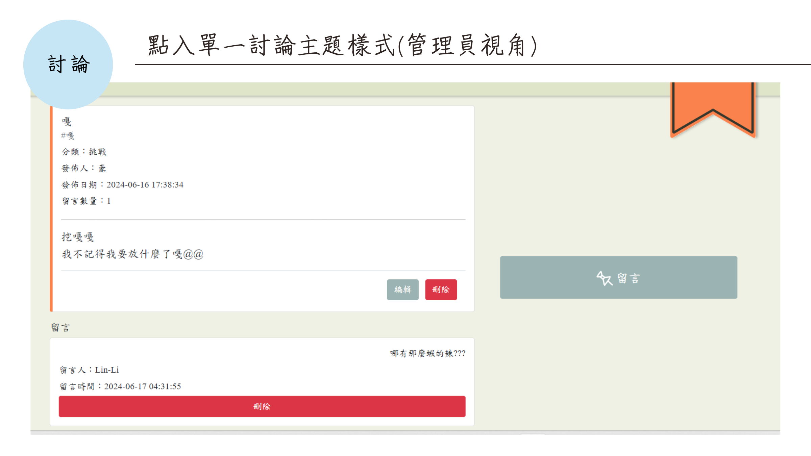
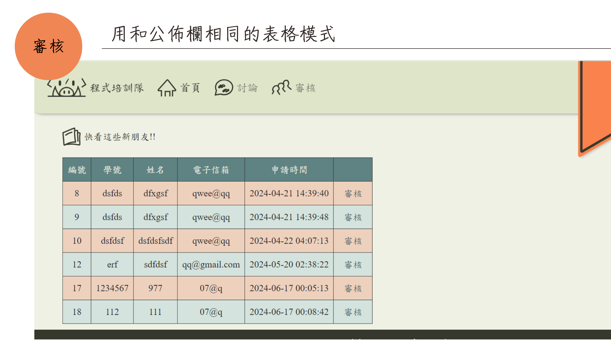
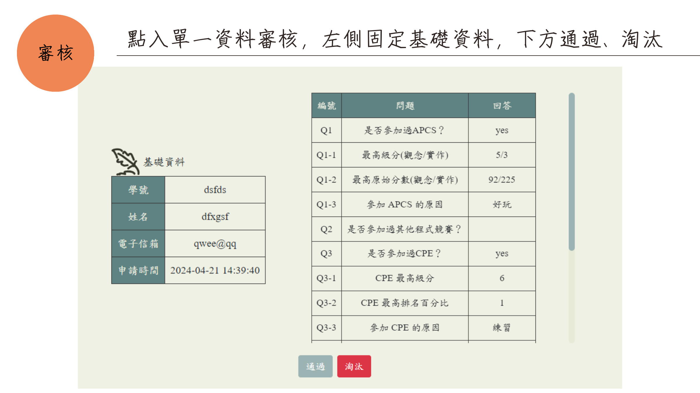
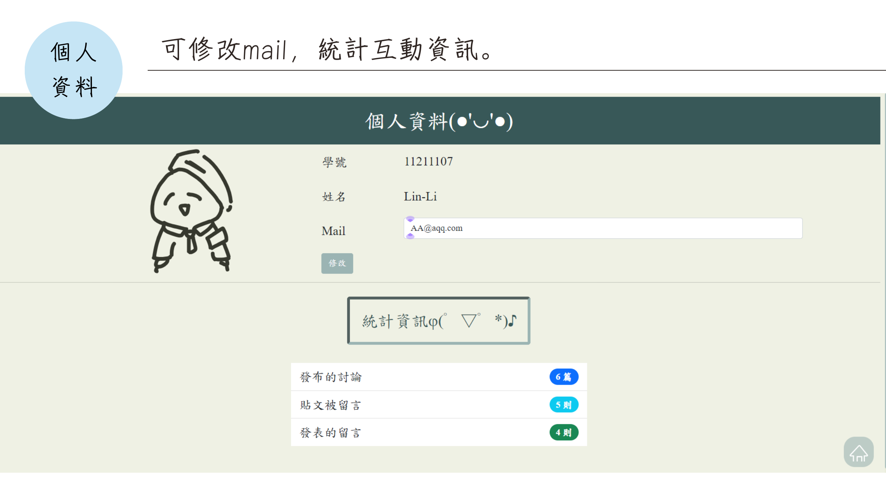

# PHP Final Project - TeamPortal

> 以 PHP、MySQL、HTML、CSS 與 JavaScript 建置的程式培訓隊會員管理網站，包含公告、分類討論、留言、會員申請、管理員審核與個人資料管理。

## 專案簡介

本專案為網頁設計課程期末專題，以「程式培訓隊」為情境，整合公開頁面、會員功能及管理員後台。系統依登入身分顯示可用功能，管理員可維護公告及審核申請，一般會員可參與討論並管理個人資料。

## 系統畫面

### 1. 系統架構



公開頁面包含首頁、聯絡資訊及登入／申請入口；登入後可使用公告、討論及個人資料功能，審核功能僅限管理員使用。

### 2. 登入與驗證碼



登入頁面包含帳號、密碼及圖形驗證碼，降低自動化嘗試登入的風險。

### 3. 公告首頁



登入後首頁顯示公告列表、日期資訊、導覽列及依帳號取得的使用者稱呼。

### 4. 公告管理



管理員可新增、檢視、修改及刪除公告；刪除操作需要再次確認。

### 5. 分類討論區



討論文章分成不同類別，並以不同側邊色彩區分，支援分類篩選及依時間排序。

### 6. 討論內容與留言



單篇討論頁面顯示文章資訊及留言，操作按鈕會依管理員、發布者或其他使用者身分調整。

### 7. 申請審核列表



管理員可查看待審核申請。審核功能不提供給一般會員。

### 8. 申請資料審核



單筆審核頁面固定顯示申請者基本資料，並列出問卷答案供管理員決定通過或淘汰。

### 9. 個人資料



會員可查看及修改電子郵件，並查看發表討論、留言與登入等互動統計資訊。

## 主要功能

### 公告系統
- 公告新增、編輯與刪除
- 刪除前再次確認
- 交錯式表格呈現
- 分頁顯示
- 彈出方式查看詳細內容

### 討論區
- 多類別討論主題
- 單選及多選分類篩選
- 依時間排序
- 文章留言
- 依使用者身分控制編輯、刪除權限

### 會員及審核
- 登入與 Session 驗證
- 圖形驗證碼
- 線上會員申請
- 管理員專用審核
- 審核通過後建立帳號
- 個人資料及互動統計

## 角色與權限

| 功能 | 訪客 | 會員 | 管理員 |
|---|:---:|:---:|:---:|
| 瀏覽公開首頁 | ✓ | ✓ | ✓ |
| 提交會員申請 | ✓ | ✓ | ✓ |
| 查看公告 | - | ✓ | ✓ |
| 參與討論與留言 | - | ✓ | ✓ |
| 查看及修改個人資料 | - | ✓ | ✓ |
| 管理公告 | - | - | ✓ |
| 刪除討論內容 | - | 依內容擁有權 | ✓ |
| 審核會員申請 | - | - | ✓ |

## 使用技術

- PHP
- MySQL
- PDO
- HTML5 / CSS3
- JavaScript
- Apache / XAMPP
- Git / GitHub

## 專案結構

```text
PHP-Final-Project-TeamPortal-main/
├── db/                    # 資料庫連線及後端處理
├── docs/
│   └── screenshots/       # README 使用的成果畫面
├── js/                    # JavaScript
├── pic/                   # 圖片及多媒體資源
├── private/               # 登入後會員及管理員頁面
├── index.php              # 公開首頁
├── LoginApply.html        # 登入與會員申請
├── style.css
├── LICENSE
└── README.md
```

## 資料庫注意事項

資料庫與文字欄位應統一採用：

```text
utf8mb4
utf8mb4_unicode_ci
```

PDO 連線字串也應包含：

```php
charset=utf8mb4
```

避免中文公告、討論分類、留言或姓名寫入時出現 `Incorrect string value`。

## 安全注意事項

此專案為課程成果版本，部署到公開環境前建議進一步完成：

- 使用 `password_hash()` 與 `password_verify()`
- 全面使用 Prepared Statements
- 增加 CSRF Token
- 強化 Session Cookie 設定
- 將資料庫帳密移至環境變數
- 驗證所有上傳及輸入內容
- 關閉正式環境中的詳細錯誤訊息

## 授權

本專案採用 [MIT License](LICENSE)。
